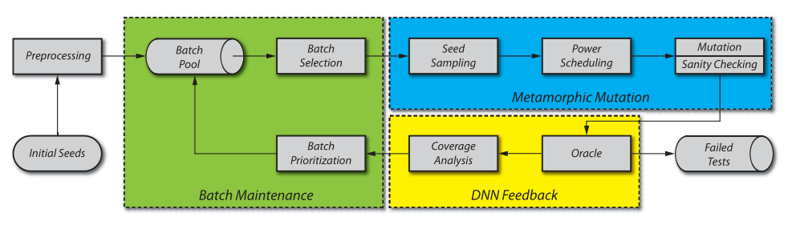
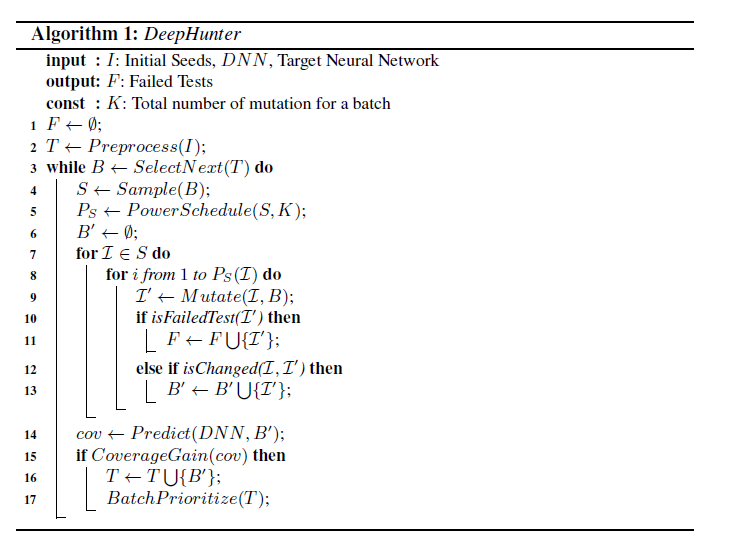

先参考deepHunter,它的目的是对模型进行模糊测试,主要实现的是扰动方法和评估部分.
扰动方法我们需要先实现一些经典的扰动方法,然后后续提出自己的.评估部分也是如此，
会先有一些基于神经元激活情况的覆盖准则的实现,然后把我们之前PPT里面提到的基于熵值的评估方法加进去.

评估是直接为了得到结论。比如，这个测试输入是否能够出发异常，总体的情况是什么样子。对模型来说，我们可以有准确率，召回率之类的常用评估标准。比如说有多少个测试用例能够被正确识别，算个准确率

神经元覆盖 Neuron Coverage (NC):阈值自己定，例如0、0.25、0.75
k-多节神经元覆盖 k-Multisection Neuron Coverage (KMNC)
神经元边界覆盖 Neuron Boundary Coverage (NBC)
强神经元激活覆盖 Strong Neuron Activation Coverage (SNAC)
Top-k神经元覆盖 Top-k Neuron Coverage (TKNC)

##deepHunter流程
###1.用初始种子构建batch，将batch添加到pool中
###2.fuzzer从pool中按某种优先级取出一个batch，从这个batch中对一些种子进行采样，对被采样的种子进行变异
###3.对于原始种子的每一个有效的突变体，test oracle将验证这是否是一个failed test。对本batch所有样本种子进行突变后，构建存活的mutant batch。收集该batch的覆盖信息

##问题：
###1.什么是failed test？变异前后预测结果和标签是否不一致么
###2.如何进行评估？用变异后的种子当测试集进行如上指标的评估吗
